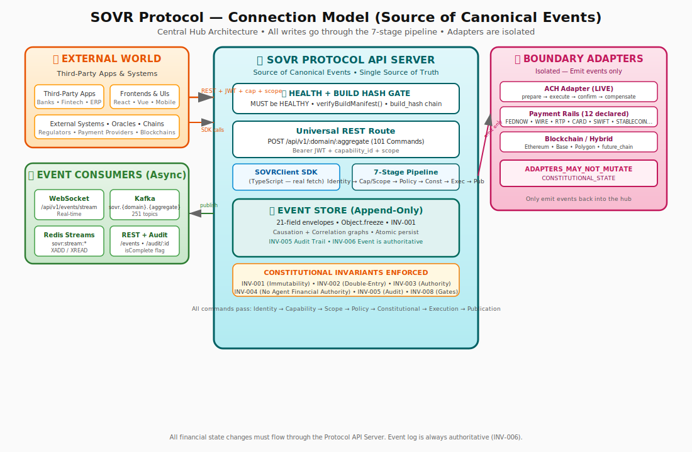

<p align="center">
  
  
  
  
  
  
</p>

<h1 align="center">SOVR Financial OS</h1>

<p align="center">
  <strong>A programmable, reserve-backed, trust-governed financial operating system.</strong><br/>
  Vault-based custody · Programmable credit rails · Tokenized value · Real-time payment orchestration · AI-driven financial agents · Policy-controlled execution · Auditable state machines
</p>

<p align="center">
  <a href="#-architecture">Architecture</a> ·
  <a href="#-domains">Domains</a> ·
  <a href="#-compiler">Compiler</a> ·
  <a href="#-boot-sequence">Boot Sequence</a> ·
  <a href="#-security-model">Security</a> ·
  <a href="#-getting-started">Getting Started</a> ·
  <a href="#-repository-structure">Repository</a>
</p>

---

## Table of Contents

- [Overview](#-overview)
- [Architecture](#-architecture)
  - [Constitutional Layers (L0–L7)](#constitutional-layers-l0l7)
  - [Build Phases (A–J)](#build-phases-aj)
  - [Dependency Graph](#dependency-graph)
- [Constitution](#-constitution)
  - [Immutable Invariants (INV-001 – INV-010)](#immutable-invariants)
  - [Conflict Resolution Priority](#conflict-resolution-priority)
  - [Authority Model](#authority-model)
  - [Financial Integrity Rules](#financial-integrity-rules)
  - [AI Agent Governance](#ai-agent-governance)
  - [Protected Articles](#protected-articles)
- [Domains](#-domains)
  - [Vault](#vault-domain)
  - [Ledger](#ledger-domain)
  - [Treasury](#treasury-domain)
  - [Identity](#identity-domain)
  - [Policy](#policy-domain)
  - [Intent](#intent-domain)
  - [Agent](#agent-domain)
  - [Payment](#payment-domain)
  - [Governance](#governance-domain)
- [Boundary Systems](#-boundary-systems)
- [Command Catalog](#-command-catalog)
- [Event Catalog](#-event-catalog)
- [State Machines](#-state-machines)
- [Security Model](#-security-model)
  - [Capabilities (107)](#capabilities)
  - [Scope Pattern Language](#scope-pattern-language)
- [Compiler](#-compiler)
  - [Compilation Pipeline](#compilation-pipeline)
  - [Output Artifacts (22)](#output-artifacts)
  - [Reproducibility (R1–R10)](#reproducibility)
  - [Pass Registry (20 Passes)](#pass-registry)
  - [Generator Registry (9 Generators)](#generator-registry)
- [Boot Sequence](#-boot-sequence)
  - [Runlevels (0–7)](#runlevels)
  - [Boot Attestation](#boot-attestation)
- [Projection Engine](#-projection-engine)
- [Saga Orchestration](#-saga-orchestration)
- [Packages](#-packages)
- [Certification](#-certification)
- [CI/CD](#-cicd)
- [Repository Structure](#-repository-structure)
- [Domain Status Matrix](#-domain-status-matrix)
- [Getting Started](#-getting-started)
- [Testing](#-testing)
- [Audit Reports](#-audit-reports)
- [Roadmap](#-roadmap)
- [Contributing](#-contributing)
- [License](#-license)

---

## 📖 Overview

**SOVR Financial OS** is a **spec-first financial kernel** — a complete, frozen YAML specification that defines every aspect of a programmable financial operating system. The specification covers:

| Capability | Description |
|:---|:---|
| **Vault-based Custody** | Asset registration, verification, reservation, locking, collateral management, and custody attestation |
| **Double-Entry Ledger** | Immutable financial history with balanced journal entries, account management, and period closes |
| **Programmable Treasury** | Transfer request → authorize → reserve → execute → settle pipeline with compensation sagas |
| **Payment Rails** | 12 external rails (ACH, FedNow, Wire, RTP, Card, Blockchain, Stablecoin, SWIFT, SEPA, Cash, Internal, Future) |
| **Identity & Auth** | Multi-factor authentication, credential management, delegation chains, trust anchors |
| **Policy Engine** | Deterministic rule evaluation with escalation, compliance mapping, and constitutional enforcement |
| **Intent Processing** | Human/agent intent → enrichment → validation → command conversion pipeline |
| **AI Agent Governance** | Bounded autonomous agents with audit envelopes, quotas, and mandatory escalation |
| **Constitutional Oversight** | Amendment process, emergency halt, proposals, and audit authority |

### What Makes SOVR Unique

1. **Constitutional Runtime** — 10 immutable invariants enforced at every command execution
2. **Event-Sourced Everything** — Every state change is an append-only immutable event
3. **AI-Governed Agents** — Agents operate under constitutional constraints with mandatory escalation
4. **Spec-First Architecture** — A single YAML specification produces all runtime artifacts
5. **Deterministic Compiler** — Byte-identical output from identical inputs (R1–R10 reproducibility)
6. **Boot Sequence** — 8-runlevel boot with cryptographic attestation (like an OS kernel)

---

## 🏗 Architecture

### Constitutional Layers (L0–L7)

SOVR's specification files are organized into **eight dependency layers**. A file in layer N may only reference files in layers 0..N.

```
┌─────────────────────────────────────────────────────────────┐
│  L7 — PRODUCTION        │ compiler.yaml, acceptance-tests  │
│  L6 — BOUNDARY          │ hybrid-boundary.yaml             │
│  L5 — INTEGRATION       │ 12_domain-contracts.yaml         │
│  L4 — INTERPRETATION    │ projection-engine.yaml           │
│  L3 — AUTHORITY         │ 08_security-capabilities.yaml    │
│  L2 — EXECUTION CONTROL │ 05_state-machines, 09_sagas      │
│  L1 — SHARED LANGUAGE   │ 02_domain-model, 03_commands,    │
│                         │ 04_events                        │
│  L0 — PROTOCOL GOVERNANCE │ 00_manifest, 01_constitution   │
└─────────────────────────────────────────────────────────────┘
```

| Layer | Name | Purpose | Files |
|:------|:-----|:--------|:------|
| **L0** | Protocol Governance | Immutable principles, priority ordering, emergency procedures | `00_protocol-manifest.yaml`, `01_constitution.yaml` |
| **L1** | Shared Language | Entity definitions, action vocabulary, fact vocabulary | `02_domain-model.yaml`, `03_command-catalog.yaml`, `04_event-catalog.yaml` |
| **L2** | Execution Control | State transitions, failure behavior, distributed coordination | `05_state-machines.yaml`, `09_saga-orchestration.yaml` |
| **L3** | Authority | Who can act, on what resources, under what scope | `08_security-capabilities.yaml` |
| **L4** | Interpretation | Derived views, read models, reporting truth | `projection-engine.yaml` |
| **L5** | Integration | Cross-domain coupling contracts and boundary contracts | `12_domain-contracts.yaml` |
| **L6** | Boundary | External system interfaces, blockchain, oracles | `hybrid-boundary.yaml` |
| **L7** | Production | Compiler specification and acceptance test suite | `compiler.yaml`, `acceptance-tests.yaml` |

### Build Phases (A–J)

The protocol was built sequentially across **11 frozen phases**:

| Phase | Name | Status | Description |
|:------|:-----|:-------|:------------|
| **A** | Protocol Foundation | ✅ COMPLETE | Constitutional invariants, conflict resolution, runtime enforcement model |
| **B** | Vault Domain | ✅ COMPLETE | Atomic value representation, assets, reserves, custody, collateral |
| **C** | Core Financial Domains | ✅ COMPLETE | Ledger, Treasury domain specifications |
| **D** | Security & Intelligence | ✅ COMPLETE | Identity, Policy, Intent, Agent domains |
| **E** | Payment Execution | ✅ COMPLETE | External payment rails, settlement adapters |
| **F** | Hybrid Execution Layer | ✅ COMPLETE | Blockchain boundaries, oracle integrations |
| **G** | Projection Engine | ✅ COMPLETE | All read models, replay protocol, caching |
| **H** | Compiler Specification | ✅ COMPLETE | Protocol compiler that produces runtime artifacts |
| **I** | Acceptance Test Suite | ✅ COMPLETE | Tests for every invariant, saga, state machine |
| **FIX** | Constitutional Fix Pass | ✅ COMPLETE | Event envelope standardization, naming normalization |
| **J** | Protocol Closure | ✅ COMPLETE | Cross-cutting registration, dependency graph, protocol freeze |

### Dependency Graph

```
                   ┌──────────┐
                   │  kernel   │
                   └────┬─────┘
                        │
              ┌─────────┼─────────┐
              ▼         ▼         ▼
         ┌────────┐ ┌────────┐ ┌──────────┐
         │governance│ │ vault  │ │  ledger  │
         └────┬───┘ └───┬────┘ └────┬─────┘
              │         │           │
     ┌────────┼─────────┼───────────┼──────────┐
     ▼        ▼         ▼           ▼          ▼
┌────────┐┌────────┐┌────────┐┌──────────┐┌────────┐
│identity││ policy ││treasury││  intent  ││runtime │
└────┬───┘└────┬───┘└───┬────┘└────┬─────┘└────────┘
     │         │        │          │
     ▼         ▼        ▼          ▼
┌────────┐┌──────────────────────────────────┐
│ agent  ││            payment               │
└────────┘└──────────────────────────────────┘
              ▲         ▲         ▲
              │         │         │
         ┌────┴───┐┌────────┐┌──────────┐
         │compiler││projection││certification│
         └────────┘└────────┘└──────────┘
```

---

## 📜 Constitution

The constitution (`01_constitution.yaml`) is the **supreme law** of SOVR Financial OS. All domains, services, agents, and external integrations must operate within its boundaries.

### Immutable Invariants

| ID | Name | Rule | Severity | Action |
|:---|:-----|:-----|:---------|:-------|
| **INV-001** | Event Immutability | Every state change requires an immutable event | Critical | Halt system |
| **INV-002** | Double-Entry Balance | No ledger mutation without balanced journal entry | Critical | Reject command |
| **INV-003** | Authority Boundary | No actor may exceed granted authority | Critical | Reject + audit |
| **INV-004** | Agent Financial Authority Prohibition | No agent may create/grant/modify financial authority | Critical | Terminate agent |
| **INV-005** | Audit Trail Completeness | Every financial action must produce auditable event trail | Critical | Reject command |
| **INV-006** | Events Describe, Don't Mutate | Events describe reality; projections interpret reality | Critical | Rebuild projection |
| **INV-007** | Value Preservation Priority | Value preservation outranks execution speed | Critical | Reject optimization |
| **INV-008** | Command Execution Gates | No command executes without identity + capability + scope + policy | Critical | Reject command |
| **INV-009** | Unknown State Representation | Unknown financial states must be represented explicitly | High | Flag for governance |
| **INV-010** | No Autonomous Bypass | No autonomous agent may bypass constitutional enforcement | Critical | Terminate agent |

### Conflict Resolution Priority

When constraints conflict, this ordering determines which wins:

| Rank | Category | Description |
|:-----|:---------|:------------|
| 1 | Invariant Preservation | Constitutional invariants are absolute |
| 2 | Asset Security | Custody, reserve integrity, collateral protection |
| 3 | Regulatory Compliance | Legal and regulatory requirements |
| 4 | Ledger Integrity | Double-entry balance, audit completeness |
| 5 | Transaction Completion | Successfully completing initiated operations |
| 6 | Operational Efficiency | Throughput, latency, resource utilization |
| 7 | Agent Autonomy | AI agent ability to act without human intervention |

> **Principle:** Speed never outranks safety. Autonomy never outranks authority.

### Authority Model

| Actor | Allowed | Forbidden | Max Autonomy |
|:------|:--------|:----------|:-------------|
| **Human** | Express intent, authorize, approve, govern, initiate transfer | Modify events, alter history, bypass policy | Full with policy governance |
| **AI Agent** | Analyze, recommend, execute approved workflows, query read models | Mint assets, alter history, bypass policy, grant capabilities | Bounded execution within policy |
| **Governance** | Amend constitution, modify policies, override agents, emergency halt | Modify immutable events, bypass double-entry | Constitutional authority with consensus |
| **System** | Enforce invariants, validate commands, rebuild projections | Originate financial commands, modify business state | Operational only |

### Financial Integrity Rules

- **Double-Entry:** Every financial state change requires a balanced journal entry (debits = credits)
- **Asset Existence:** No transfer of an asset that doesn't exist in the Vault
- **Reserve Sufficiency:** No transfer exceeding available reserve
- **Atomicity:** Financial operations are atomic via saga orchestration
- **Uniqueness:** Every operation has a globally unique, immutable identifier
- **Finality:** Once settled, operations are final unless reversed through explicit audited commands

### AI Agent Governance

- Every agent action requires a traceable `intent_id` linking to human/governance directive
- Agents must emit an **audit envelope** for every action (agent_id, intent_id, command_id, policy_evaluation_result, model_version, etc.)
- Approaching authority boundaries (within 10%) triggers **mandatory escalation**
- Novel situations, conflicting policies, or external system unavailability trigger mandatory escalation
- Agents may **never** create, grant, or modify financial authority

### Protected Articles

| Protection Level | Articles |
|:-----------------|:---------|
| **Immutable** | Ledger integrity, event immutability, double-entry accounting, audit trail completeness, value preservation, agent authority prohibition |
| **Highly Protected** | Conflict resolution order, authority model, financial integrity rules, agent governance rules |
| **Modifiable** (with amendment) | Governance structure details, operational parameters, domain contracts, boundary configuration |

---

## 🏦 Domains

SOVR defines **9 first-class domains** that cover the complete operational surface of a financial operating system.

### Vault Domain

> **Question it answers:** "Can value exist?"

The Vault is the **Value Authority Domain** — it defines what SOVR recognizes as value.

| Entity | Description | Key States |
|:-------|:------------|:-----------|
| `asset` | A unit of value recognized by SOVR | REGISTERED → VERIFIED → AVAILABLE → RESERVED → LOCKED → CONSUMED |
| `reservation` | A soft or hard lock on asset value | PENDING → ACTIVE → CONSUMED/EXPIRED/RELEASED |
| `collateral_position` | An asset pledged as security | PROPOSED → ACTIVE → MARGIN_CALL → LIQUIDATING → RELEASED/LIQUIDATED |
| `custody_attestation` | Proof that an asset exists at a custody location | Active, expired |
| `valuation` | A trusted price assessment | oracle, internal_pricing, market_feed, manual |
| `balance` | Computed view of holdings | total, available, reserved, locked, encumbered |
| `reconciliation_record` | Vault reconciliation operation | STARTED → IN_PROGRESS → COMPLETED/DISCREPANCY_FOUND |

**Commands:** 13 (asset.register, asset.verify, asset.reject, reserve.create, reserve.lock, reserve.release, reserve.expire, collateral.add, collateral.remove, collateral.revalue, asset.reconcile, valuation.update)

**Events:** 21 (asset.registered, asset.verified, asset.rejected, asset.impaired, reserve.created, reserve.locked, reserve.released, reserve.expired, collateral.added, collateral.valued, collateral.revalued, collateral.released, collateral.margin_call, custody.attested, valuation.updated, reconciliation.started/completed/discrepancy_found, ownership.transferred)

### Ledger Domain

> **Question it answers:** "How is truth recorded?"

The Ledger is the **Immutable Financial History Domain** — the source of financial truth.

| Entity | Description |
|:-------|:------------|
| `ledger` | Top-level financial record container |
| `journal` | Named collection of journal entries for a domain |
| `journal_entry` | Balanced double-entry record of a financial event |
| `posting` | Single debit or credit line within a journal entry |
| `account` | Named container for tracking financial activity (ASSET, LIABILITY, EQUITY, REVENUE, EXPENSE, MEMORANDUM, RESERVE, COLLATERAL) |
| `accounting_period` | Time-bounded interval for financial reporting |
| `ledger_reconciliation` | Reconciliation process comparing against external sources |

**Commands:** 7 (journal.create, entry.post, entry.reverse, entry.correct, reconciliation.start, reconciliation.resolve, account.create, account.freeze, period.close)

**Events:** 14 (journal.created, entry.posted, entry.rejected, entry.reversed, entry.corrected, account.created, account.frozen, account.closed, reconciliation.started/mismatch_detected/completed, period.closing/closed)

### Treasury Domain

> **Question it answers:** "Can value move?"

The Treasury is the **Controlled Movement Authority Domain**.

| Entity | Description |
|:-------|:------------|
| `transfer_request` | Initial request to move value |
| `transfer_order` | Authorized, executable transfer with full audit lineage |
| `liquidity_position` | System-wide liquidity state for an asset |
| `settlement_instruction` | Instruction sent to Payment domain |
| `settlement_confirmation` | Evidence that settlement occurred |
| `routing_decision` | Decision of how and where to settle |

**Transfer Lifecycle:** `REQUESTED → AUTHORIZED → RESERVED → EXECUTING → PENDING_SETTLEMENT → SETTLED`

**Commands:** 8 (transfer.request, transfer.authorize, transfer.reserve, transfer.execute, transfer.cancel, transfer.compensate, liquidity.check, liquidity.allocate, settlement.confirm)

**Events:** 12 (transfer.requested, transfer.authorized, transfer.rejected, transfer.reserved, transfer.executing, transfer.settled, transfer.failed, transfer.expired, transfer.compensation_required, liquidity.warning, settlement.confirmed)

### Identity Domain

> **Question it answers:** "Who is acting?"

| Entity | Description |
|:-------|:------------|
| `actor` | Core identity (human, organization, ai_agent, service_account, governance, external_system) |
| `credential` | Authentication credential (cryptographic_key, biometric, hardware_token, delegated_token) |
| `trust_anchor` | Root of trust for identity verification chains |
| `delegation` | Delegation of capabilities from one identity to another |
| `session` | Active authentication session |
| `authentication_context` | Full authentication context output |

**Trust Levels:** NONE → LOW → MEDIUM → HIGH → SOVEREIGN

**Commands:** 12 (actor.register, actor.verify, actor.suspend, actor.revoke, actor.archive, credential.issue, credential.revoke, session.create, session.terminate, delegation.create, delegation.revoke, trust_anchor.register)

### Policy Domain

> **Question it answers:** "Is this action permitted?"

| Entity | Description |
|:-------|:------------|
| `policy_rule` | Single rule for authorization, risk, or compliance |
| `policy_set` | Named collection of rules with evaluation strategy |
| `policy_evaluation` | Single evaluation event |
| `policy_escalation` | Escalation triggered during evaluation |

**Evaluation Strategies:** FIRST_MATCH, ALL_MUST_PASS, MAJORITY, WEIGHTED_SCORE

**Decisions:** ALLOW, DENY, ESCALATE, DEFER

**Commands:** 8 (rule.create, rule.update, rule.activate, rule.deactivate, set.create, set.evaluate, escalation.resolve, compliance.requirement.register)

### Intent Domain

> **Question it answers:** "What does the actor want to do?"

| Entity | Description |
|:-------|:------------|
| `intent` | A user or agent intent to perform an action |
| `enrichment_step` | Single step in the enrichment pipeline |
| `intent_validation` | Validation result for an intent |
| `command_conversion` | Conversion of intent into executable command |

**Intent Lifecycle:** `RECEIVED → ENRICHING → VALIDATING → READY → CONVERTED_TO_COMMAND`

**Intent Types:** COMPLETE, PARTIAL, CONDITIONAL, DELEGATED, SCHEDULED, MULTI_STEP

**Commands:** 9 (submit, enrich, validate, convert_to_command, cancel, archive, multi_step.create, multi_step.advance)

### Agent Domain

> **Question it answers:** "Can intelligence request action?"

| Entity | Description |
|:-------|:------------|
| `agent_instance` | A running AI agent instance |
| `agent_registration` | Governance registration for a proposed agent |
| `capability_binding` | Binding of a capability to an agent |
| `agent_audit_envelope` | Immutable audit record of a single execution |
| `execution_quota` | Resource and scope limits within a time period |

**Agent Types:** FINANCIAL_ANALYST, TREASURY_OPERATOR, COMPLIANCE_MONITOR, RECONCILIATION, REPORTING, CUSTOM

**Lifecycle:** `REGISTERED → ACTIVE → EXECUTING → COMPLETED/ESCALATED/FAILED → TERMINATED`

**Commands:** 8 (register, activate, terminate, capability.bind, capability.revoke, quota.update, governance.override, execution.execute)

### Payment Domain

> **Question it answers:** "Can execution leave the system?"

| Entity | Description |
|:-------|:------------|
| `payment_request` | Request to execute through an external rail |
| `execution_plan` | Routing and execution plan for a payment |

**Supported Rails:** ACH, FEDNOW, WIRE, RTP, CARD, BLOCKCHAIN, INTERNAL_TRANSFER, STABLECOIN, SWIFT, SEPA, CASH_SETTLEMENT, FUTURE_ADAPTER

**Lifecycle:** `RECEIVED → PLANNING → ROUTING → PREPARING → EXECUTING → CONFIRMING → RECONCILING → SETTLED`

**Commands:** 10 (request.create, request.cancel, execution.plan, execution.execute, execution.confirm, execution.compensate, reconciliation.start, reconciliation.complete, receipt.issue)

### Governance Domain

> **Question it answers:** "Who oversees the system?"

| Entity | Description |
|:-------|:------------|
| `governance_proposal` | Proposed governance action requiring review |
| `governance_amendment` | Proposed change to the constitutional framework |
| `governance_override` | Override of agent decision or system behavior |
| `emergency_halt` | Record of emergency system halt |
| `audit_record` | Governance-initiated audit record |
| `escalation` | Governance escalation record |

**Commands:** 12 (proposal.submit, proposal.approve, proposal.reject, amend.propose, amend.ratify, emergency.halt, emergency.lift, audit.query, oversight.review, capability.grant, capability.revoke, escalation.resolve, policy_rule.review)

---

## 🌐 Boundary Systems

SOVR interfaces with external systems it does not own:

| System | Description | Handoff Protocol | Finality |
|:-------|:------------|:-----------------|:---------|
| **SOVR Hybrid Engine** | Blockchain settlement (sFIAT, SOVR token, reserve management) | Attestation-based | Probabilistic |
| **External Payment Providers** | Banking rails, card networks, stablecoin networks | Adapter-based | Rail-specific |
| **Regulatory Interfaces** | Reporting endpoints, audit export, compliance certification | Batch export | Acknowledgment-based |

---

## 📋 Command Catalog

**101 commands** across 9 domains, each with:

- **Aggregate** — The entity being operated on
- **Issuer** — Who can execute (actor types + minimum capability)
- **Authorization Requirements** — Identity, capability, scope, policy
- **Validation Rules** — Precise validation with `on_failure` actions
- **Required Payload** — Fields that must be provided
- **Resulting Events** — Success and failure events emitted
- **Constitutional Gates** — Identity, policy, capability requirements

Every command passes through the **7-stage command pipeline**:

```
Identity Verification → Capability Check → Scope Validation → Policy Evaluation → Constitutional Compliance → Execution → Event Publication
```

---

## 📡 Event Catalog

**251 events** across 9 domains + kernel events. Every event includes the **mandatory event envelope** (21 fields):

```
event_id, event_name, event_version, aggregate, aggregate_id, source_domain,
command_id, triggering_command, causation_id, correlation_id, actor_id,
identity_context, policy_decision_id, capability_id, timestamp, payload,
projection_effect, audit (constitutional_rules_referenced, enforcement_actions, retention_class)
```

**Key Principle (INV-006):** Events do not mutate reality. Events describe reality. Projections interpret reality.

**Retention Classes:** `permanent`, `regulatory_7y`, `operational_90d`, `session`

---

## ⚙️ State Machines

**21 state machines** covering all domain lifecycles:

| Domain | State Machine | States | Final States |
|:-------|:-------------|:-------|:-------------|
| Vault | Asset Lifecycle | 10 (REGISTERED → VERIFIED → AVAILABLE → RESERVED → LOCKED → CONSUMED → RELEASED → RECONCILIATION_REQUIRED → REJECTED → IMPAIRED) | REJECTED, IMPAIRED |
| Vault | Reservation Lifecycle | 6 (PENDING → ACTIVE → CONSUMED → EXPIRED → RELEASED → FAILED) | EXPIRED, FAILED |
| Vault | Collateral Lifecycle | 6 (PROPOSED → ACTIVE → MARGIN_CALL → LIQUIDATING → RELEASED → LIQUIDATED) | RELEASED, LIQUIDATED |
| Vault | Transaction Lifecycle | 9 (CREATED → FUNDING_REQUESTED → FUNDING_PENDING → FUNDED → RELEASE_PENDING → RELEASE_AUTHORIZED → DISBURSED → CLOSED → FAILED) | CLOSED, FAILED |
| Ledger | Journal Entry Lifecycle | 6 (CREATED → VALIDATING → POSTED → SETTLED → RECONCILED → REJECTED) | REJECTED |
| Ledger | Account Lifecycle | 3 (ACTIVE → FROZEN → CLOSED) | FROZEN, CLOSED |
| Treasury | Transfer Lifecycle | 11 (REQUESTED → AUTHORIZED → RESERVED → EXECUTING → PENDING_SETTLEMENT → SETTLED → REJECTED → EXPIRED → FAILED → COMPENSATION_REQUIRED → UNKNOWN_EXTERNAL_STATE) | SETTLED, REJECTED, EXPIRED |
| Identity | Actor Lifecycle | 6 (PENDING_VERIFICATION → VERIFYING → ACTIVE → SUSPENDED → REVOKED → ARCHIVED) | REVOKED, ARCHIVED |
| Identity | Credential Lifecycle | 5 (ACTIVE → EXPIRED → REVOKED → SUSPENDED → ROTATED) | REVOKED, ROTATED |
| Identity | Session Lifecycle | 4 (ACTIVE → EXPIRED → REVOKED → TERMINATED) | EXPIRED, REVOKED, TERMINATED |
| Identity | Delegation Lifecycle | 4 (PENDING_ACCEPTANCE → ACTIVE → EXPIRED → REVOKED) | EXPIRED, REVOKED |
| Policy | Evaluation Lifecycle | 6 (IDLE → GATHERING_CONTEXT → EVALUATING_RULES → COMPUTING_DECISION → DECISION_RENDERED → ARCHIVED) | ARCHIVED |
| Policy | Rule Lifecycle | 4 (DRAFT → ACTIVE → INACTIVE → ARCHIVED) | ARCHIVED |
| Intent | Intent Lifecycle | 9 (RECEIVED → ENRICHING → VALIDATING → READY → CONVERTED_TO_COMMAND → FAILED → CANCELLED → EXPIRED → ARCHIVED) | ARCHIVED, FAILED, CANCELLED, EXPIRED |
| Agent | Execution Lifecycle | 6 (ACTIVE → EXECUTING → COMPLETED → ESCALATED → FAILED → TERMINATED) | TERMINATED |
| Agent | Agent Lifecycle | 4 (REGISTERED → ACTIVE → SUSPENDED → TERMINATED) | TERMINATED |
| Payment | Payment Request Lifecycle | 12 (RECEIVED → PLANNING → ROUTING → PREPARING → EXECUTING → CONFIRMING → RECONCILING → SETTLED → FAILED → COMPENSATING → REVERSED → CANCELLED) | SETTLED, REVERSED, CANCELLED |
| Payment | Adapter Lifecycle | 4 (ENABLED → PREPARING → EXECUTING → DISABLED) | DISABLED |
| Governance | Proposal Lifecycle | 7 (DRAFT → PENDING_REVIEW → APPROVED → REJECTED → EXPIRED → IMPLEMENTED → CANCELLED) | REJECTED, EXPIRED, CANCELLED, IMPLEMENTED |
| Kernel | Saga Lifecycle | 6 (PENDING → RUNNING → COMPLETED → FAILED → COMPENSATING → COMPENSATED) | COMPLETED, FAILED, COMPENSATED |
| Kernel | System Health Lifecycle | 4 (HEALTHY → DEGRADED → HALTED → UNKNOWN) | HALTED |

---

## 🔐 Security Model

### Capabilities

**107 capabilities** organized by domain with the following properties:

- **Scope Pattern Language** — `{resource}:{id}:{field}` with wildcard support
- **Risk Levels** — NONE, LOW, MEDIUM, HIGH, CRITICAL
- **Grantable By** — governance, human, system, self
- **Delegation Depth** — 0-2 levels maximum
- **Conditions** — Per-capability constraints (e.g., `amount <= per_transfer_limit`)

**Special Capabilities:**
- `system.internal` — Meta-capability for automated pipeline (not grantable)
- `governance.*` — Wildcard for governance actors

### Scope Pattern Language

```
vault.asset:{asset_id}               # Specific asset
treasury.transfer:{actor_id}:*       # All transfers for an actor
ledger.entry:*:account_id={acct_id}  # All entries for specific account
governance:proposal:*                # All governance proposals
```

---

## 🔧 Compiler

The compiler (`compiler.yaml`) consumes the frozen YAML specification and produces all runtime artifacts deterministically.

**Tech Stack:**
- **Runtime:** TypeScript / Node.js 20+
- **Framework:** Fastify
- **ORM:** Prisma
- **Event Streaming:** Apache Kafka
- **Cache:** Redis
- **Workflow:** Temporal

### Compilation Pipeline

```
┌──────┐    ┌─────────┐    ┌─────────┐    ┌──────────┐    ┌──────────┐    ┌────────┐
│ PARSE │───▶│ VALIDATE│───▶│ RESOLVE │───▶│ TRANSFORM│───▶│ GENERATE │───▶│ VERIFY │
└──────┘    └─────────┘    └─────────┘    └──────────┘    └──────────┘    └────────┘
```

| Stage | Actions | Error Action |
|:------|:--------|:-------------|
| **PARSE** | YAML_PARSE, SCHEMA_VALIDATION, SYNTAX_CHECK | ABORT_WITH_PARSE_ERROR |
| **VALIDATE** | Reference integrity, cross-file validation, enum validation, duplicate detection | ABORT_WITH_VALIDATION_ERROR |
| **RESOLVE** | Dependency graph build, topological sort, reference expansion, type resolution | ABORT_WITH_RESOLUTION_ERROR |
| **TRANSFORM** | Template selection, code generation, import resolution, namespace assignment (parallel) | ABORT_WITH_GENERATION_ERROR |
| **GENERATE** | File write, directory creation, config generation | ABORT_WITH_IO_ERROR |
| **VERIFY** | TypeScript compile check, circularity check, test compile, coverage ≥ 95%, artifact count | REPORT_WARNINGS |

### Output Artifacts

| # | Artifact | Source | Template | Output Pattern |
|:--|:---------|:-------|:---------|:---------------|
| 1 | TypeScript Types | domain-model, domains | ENTITY_TO_TYPESCRIPT | `src/types/{domain}/{entity}.ts` |
| 2 | Validation Library (Zod) | domain-model, commands | ZOD_SCHEMAS | `src/validation/{domain}/{entity}.schema.ts` |
| 3 | Fastify Routes | commands, capabilities | FASTIFY_CONTROLLER | `src/routes/{domain}/{aggregate}.route.ts` |
| 4 | OpenAPI 3.1 Spec | commands, domain-model, events | OPENAPI_3_1 | `openapi.yaml` |
| 5 | JSON Schemas | domain-model, commands, events | JSON_SCHEMA_DRAFT_2020_12 | `schemas/{domain}/{entity}.schema.json` |
| 6 | Event Classes | events, domains | TYPESCRIPT_EVENT_CLASS | `src/events/{domain}/{aggregate}.events.ts` |
| 7 | Command Classes | commands | TYPESCRIPT_COMMAND_CLASS | `src/commands/{domain}/{aggregate}.commands.ts` |
| 8 | Aggregate Roots | domain-model, state-machines | EVENT_SOURCED_AGGREGATE | `src/aggregates/{domain}/{entity}.aggregate.ts` |
| 9 | Read Models (Projections) | projection-engine | EVENT_HANDLER_PROJECTION | `src/projections/{name}.projection.ts` |
| 10 | Prisma Models | domain-model | PRISMA_SCHEMA | `prisma/schema.prisma` |
| 11 | SQL Migrations | domain-model | POSTGRESQL_MIGRATION | `migrations/{timestamp}_{desc}.sql` |
| 12 | Kafka Topics | events | KAFKA_TOPIC_CONFIG | `config/kafka/topics.yaml` |
| 13 | Redis Streams | events, sagas | REDIS_STREAM_CONFIG | `config/redis/streams.yaml` |
| 14 | Workflow Definitions | sagas, state-machines | TEMPORAL_WORKFLOW | `src/workflows/{saga_name}.workflow.ts` |
| 15 | Policy Engine | capabilities, policy | RULES_ENGINE | `src/policy/engine.ts` |
| 16 | Capability Engine | capabilities | CAPABILITY_CHECKER | `src/security/capability-engine.ts` |
| 17 | Test Skeletons | acceptance-tests | VITEST_TEST_SUITE | `tests/{category}/{name}.test.ts` |
| 18 | TLA+ Formal Verification Models | state-machines, sagas | STATE_MACHINE_TO_TLA | `verification/tla/{name}.tla` |
| 19 | VEL Sandbox Evaluator | constitution, policy | RULES_TO_VEL_AST | `src/policy/vel-evaluator.ts` |
| 20 | Guardrail Command Bus | constitution | INVARIANT_GUARDRAIL_INTERCEPTOR | `src/execution/guardrail-bus.ts` |
| 21 | Agent Governor Sandbox SDK | constitution, agent | GOVERNOR_SANDBOX_SDK | `src/sdk/agent-sandbox.ts` |
| 22 | Protocol Topology Lineage | ALL | PIR_TO_KNOWLEDGE_GRAPH | `protocol-topology.json` / `docs/topology.md` |

### 🌟 Advanced Compiler & Runtime Integrations

To elevate SOVR beyond traditional systems, we have added **five enterprise-grade advanced features** compiled directly into the kernel and runtime outputs:

#### 1. Formal Model Verification (TLA+)
* **File Pattern:** `generated/verification/tla/{name}.tla`
* State machines and multi-step orchestration Sagas are compiled directly into model-checkable **TLA+ modules**. This mathematically proves the absence of execution deadlocks, infinite cycles, or orphaned state transitions under model checks.

#### 2. Sandboxed Validation Expression Language (VEL) Evaluator
* **File Pattern:** `generated/src/policy/vel-evaluator.ts`
* Validation logic and policy constraints are compiled into static Abstract Syntax Trees (ASTs) processed by a deterministic, sandboxed, and Turing-incomplete interpreter. This enforces perfect safety with zero vulnerability risks (like prototype pollution, arbitrary code execution, or performance hang cycles).

#### 3. Active Constitutional Guardrails on the Command Bus
* **File Pattern:** `generated/src/execution/guardrail-bus.ts`
* Rather than relying solely on business logic correctness, an intercepting **Guardrail Command Bus** executes isolated dry-runs of incoming commands, actively checking state mutations against **INV-001 (Event Immutability)** and **INV-002 (Double-Entry Balance)** before committing to the database.

#### 4. Autonomous AI-Agent Governor Sandbox SDK
* **File Pattern:** `generated/src/sdk/agent-sandbox.ts`
* Operating under **INV-004** and **INV-010**, all AI agent execution passes through the `AgentSandbox`. This sandbox tracks financial spending quotas, records LLM prompts using secure SHA-256 hashes for permanent audit logs, and triggers **mandatory human-in-the-loop escalation** when spending approaches 90% of the allocated threshold.

#### 5. Interactive Protocol Topology & Graph Lineage
* **File Pattern:** `generated/protocol-topology.json` & `generated/docs/topology.md`
* Consolidates the complete Protocol Intermediate Representation (PIR) into a machine-readable JSON graph topology and an interactive Mermaid diagram, allowing compliance officers and regulators to visually audit how commands, events, capabilities, and invariants link together.

### Reproducibility

The compiler enforces **10 reproducibility rules (R1–R10)**:

| Rule | Description |
|:-----|:------------|
| R1 | Closed frontier — only declared inputs are read |
| R2 | Sorted lists — all collections sorted for deterministic ordering |
| R3 | Canonical serialization — NFC Unicode, LF line endings |
| R4 | No randomness — no `Math.random()`, no UUID generation during compile |
| R5 | No environment leakage — no `process.env`, no hostname, no username |
| R6 | Stable dispatch order — generators run in registry-declared order |
| R7 | Deterministic paths — output paths derived from input, not timestamps |
| R8 | Version included — compiler version in build hash |
| R9 | Byte-identical manifest — `build_hash = sha256(sorted(input_hashes) + ir_hash + sorted(output_hashes) + compiler_version + registry_versions)` |
| R10 | Environmental isolation — compile in clean environment |

### Pass Registry

**20 compilation passes** organized into 8 phases:

```
DISCOVERY → PARSE → VALIDATE → RESOLVE → TRANSFORM → GENERATE → CERTIFY → REPORT
```

Each pass has:
- Deterministic execution
- DAG-enforced ordering (depends_on)
- Certification level
- Error codes from error taxonomy

### Generator Registry

**9 generators** in deterministic dispatch order:

1. **TypeScript** — Types, commands, events, aggregates, projections
2. **JSON Schema** — Validation schemas
3. **OpenAPI** — API documentation
4. **Graph Export** — Knowledge graph
5. **Documentation** — Markdown docs
6. **Acceptance Tests** — Test skeletons
7. **Audit Reports** — Compliance evidence
8. **SDK** — Client SDK
9. **Certification** — Certification artifacts

---

## 🚀 Boot Sequence

SOVR implements an **8-runlevel boot sequence** modeled after Linux:

| Runlevel | Linux Analogy | SOVR Stage | What It Does |
|:---------|:-------------|:-----------|:-------------|
| **0** | BIOS POST | `FIRMWARE_POST` | SHA256 self-test, env isolation, Node ≥20, heap check |
| **1** | GRUB + Secure Boot | `BOOTLOADER` | Verify `compiler-manifest.yaml` build_hash, tamper detection, protocol FROZEN check |
| **2** | Kernel decompress | `KERNEL_INIT` | Load 10 invariants (INV-001..010), event envelope, authority model |
| **3** | Mount root fs | `CORE_DOMAINS` | Vault, Ledger, Treasury — topological order per dependency graph |
| **4** | Load LSM/SELinux | `SECURITY_SUBSYSTEM` | Identity, Policy, Intent, Agent |
| **5** | Load drivers | `EXECUTION_BOUNDARY` | Payment 12 rails, Hybrid 4 chains, 5 oracles |
| **6** | Mount /proc | `INTERPRETATION` | Projection engine, 15 read models rebuilt from genesis |
| **7** | systemd → graphical | `USERLAND` | Runtime SDK, OpenAPI 44 endpoints, boot attestation |

### Boot Attestation

The boot process produces a **cryptographic attestation** that proves the kernel booted from the exact frozen YAML:

```
boot_hash = sha256(build_hash + boot_log_hash + boot_timings_hash + final_health)
```

**Output Files:**
```
generated/
  boot.log                ← Human-readable dmesg-like log
  boot-manifest.json      ← Stages, timings, events, health, build_hash
  boot-attestation.json   ← boot_hash + splash + verification instructions
```

**Frontend Gate:** Frontend must NOT load financial commands until Runlevel 7 returns `HEALTHY`.

---

## 👁️ Projection Engine

**15 read models** rebuilt from the event store:

Each projection has:
- **Source events** — Which events it consumes
- **Ordering guarantees** — How events are sequenced
- **Conflict resolution** — How to handle concurrent updates
- **Rebuild strategy** — Full replay vs incremental
- **Caching** — Redis cache invalidation keys

Projections are **never authoritative** — if a projection disagrees with the event log, the event log wins (INV-006).

---

## 🔗 Saga Orchestration

Multi-step financial operations use **saga orchestration** for atomicity:

- **Compensation handlers** for every step that has side effects
- **Temporal workflows** for long-running operations
- **Timeout handling** with exponential backoff
- **Governance escalation** when automated compensation fails

---

## 📦 Packages

| Package | Version | Description |
|:--------|:--------|:------------|
| [`@sovr/compiler`](./packages/compiler) | `0.2.0-kernel-working` | Deterministic YAML compiler — consumes specs, produces runtime artifacts |
| [`@sovr/runtime`](./packages/runtime) | `0.2.0-kernel-working` | Financial OS runtime — SDK, execution context, adapters |

### Compiler Package

```bash
# Compile YAML → artifacts + manifest with build_hash
node packages/compiler/dist/cli.js compile

# Verify reproducibility (byte-identical)
node packages/compiler/dist/cli.js verify

# Boot kernel → 8 runlevels → attestation
node packages/compiler/dist/cli.js boot
```

### Runtime Package

```typescript
import { SOVRClient } from '@sovr/runtime'

const client = new SOVRClient({ apiUrl: '...', buildHash: '...' })
await client.verifyBuildManifest('...') // Unfakeable check
// Now safe to call treasury.transfer.request
```

---

## 🏆 Certification

**40+ certification artifacts** in `/certification/`:

| Category | Key Artifacts |
|:---------|:-------------|
| **Compiler Trust** | COMPILER_TRUST_PACKAGE, COMPILER_ARTIFACT_INTEGRITY_CERTIFICATION, COMPILER_REPRODUCIBILITY_CERTIFICATION |
| **Constitutional** | CONSTITUTIONAL_CONVERGENCE_CERTIFICATION, CONSTITUTIONAL_AUTHORITY_MAP, CONSTITUTION_RUNTIME_TRACE |
| **Acceptance** | ACCEPTANCE_EVIDENCE_CLOSURE, ACCEPTANCE_TRACEABILITY_MATRIX |
| **Domain** | DOMAIN_COMPILER_COMPLETENESS, SPECIFICATION_COVERAGE_MATRIX |
| **Events** | EVENT_CATALOG_COMPLETENESS, EVENT_NAMING_STANDARD, EVENT_ORPHAN_REPORT |
| **Runtime** | RUNTIME_AUTHORITY_BOUNDARY, RUNTIME_AUTHORITY_MATRIX, REPLAY_ENGINE_CERTIFICATION |
| **Production** | PRODUCTION_GATE, PHASE_XIV_OPERATIONAL_READINESS |

---

## 🔄 CI/CD

Two GitHub Actions workflows:

### CI Pipeline (`.github/workflows/ci.yml`)

```
Lint & Typecheck → Test Suite → Build → Docker Build
```

### Production Pipeline (`.github/workflows/ci-production.yml`)

```
Lint & Typecheck → Test (Postgres) + Security Scan → Build → Docker → Certification → Deploy Staging → Deploy Production → Rollback
```

**Tech:** Node.js 20, PostgreSQL 16, Docker Buildx, GHCR, Snyk security scanning

---

## 📂 Repository Structure

```
SOVR-Protocol/
│
├── 📜 PROTOCOL SPECIFICATION (Root YAML — 15 files, ~600KB)
│   ├── 00_protocol-manifest.yaml      ← Entry point: layers, domains, build phases
│   ├── 01_constitution.yaml           ← Supreme law: invariants, authority, enforcement
│   ├── 02_domain-model.yaml           ← 47 entities across 9 domains
│   ├── 03_command-catalog.yaml         ← 101 commands with validation rules
│   ├── 04_event-catalog.yaml           ← 251 events with full envelope
│   ├── 05_state-machines.yaml          ← 21 state machines
│   ├── 08_security-capabilities.yaml   ← 107 capabilities + scope language
│   ├── 09_saga-orchestration.yaml      ← Saga definitions + compensation
│   ├── 11_governance-amendments.yaml   ← Amendment process
│   ├── 12_domain-contracts.yaml        ← Inter-domain coupling contracts
│   ├── 13_compiler-adr.yaml           ← 12 architectural decision records
│   ├── compiler.yaml                   ← Compiler specification
│   ├── hybrid-boundary.yaml            ← Blockchain + oracle boundaries
│   ├── projection-engine.yaml          ← 15 read models
│   └── acceptance-tests.yaml           ← 60 acceptance tests
│
├── 📁 domains/                         ← Per-domain detailed specifications
│   ├── agent.yaml
│   ├── governance.yaml
│   ├── identity.yaml
│   ├── intent.yaml
│   ├── ledger.yaml
│   ├── payment.yaml
│   ├── policy.yaml
│   ├── treasury.yaml
│   └── vault.yaml
│
├── 📁 compiler/                        ← Compiler contracts & registries
│   ├── COMPILER_MANIFEST.yaml          ← Compiler readiness declaration
│   ├── SEMANTIC_COMPILER_CONTRACT.yaml ← "No guessing" contract
│   ├── PASS_REGISTRY.yaml              ← 20 compilation passes (DAG)
│   ├── GENERATOR_REGISTRY.yaml         ← 9 code generators
│   ├── BUILD_MANIFEST.yaml             ← Reproducibility rules (R1-R10)
│   ├── ERROR_TAXONOMY.yaml             ← 23 diagnostic codes
│   └── compiler.yaml                   ← Duplicate of root compiler spec
│
├── 📁 protocol/                        ← Governance draft registries
│   ├── ACCEPTANCE_STANDARD.yaml
│   ├── AGGREGATE_REGISTRY.yaml
│   ├── BOOT_SEQUENCE.yaml
│   ├── CANONICAL_AUTHORITY_MODEL.yaml
│   ├── DOMAIN_REGISTRY.yaml
│   └── METADATA_STANDARD.yaml
│
├── 📁 certification/                   ← 40+ certification artifacts
│   ├── COMPILER_TRUST_PACKAGE.yaml
│   ├── CONSTITUTIONAL_CONVERGENCE_CERTIFICATION.yaml
│   ├── PRODUCTION_GATE.yaml
│   └── ... (37 more)
│
├── 📁 packages/
│   ├── compiler/                       ← @sovr/compiler
│   │   ├── src/                        ← TypeScript source
│   │   │   ├── boot/                   ← Boot sequence implementation
│   │   │   ├── generators/             ← Code generators (6)
│   │   │   ├── ir/                     ← Intermediate representation
│   │   │   ├── pipeline/               ← Parse + validate pipeline
│   │   │   └── utils/                  ← Hash, YAML loader
│   │   ├── dist/                       ← Compiled JavaScript
│   │   └── package.json
│   └── runtime/                        ← @sovr/runtime
│       ├── src/
│       │   ├── adapters/               ← Boundary adapters
│       │   ├── execution/              ← Execution context
│       │   └── sdk/                    ← SOVR client SDK
│       ├── generated/manifests/        ← Generated domain manifests
│       └── package.json
│
├── 📁 containers/                      ← 16 domain container metadata
│   ├── vault/                          (STATUS.yaml, TASK_BOARD.yaml, DEPENDENCIES.yaml)
│   ├── ledger/
│   ├── treasury/
│   ├── payment/
│   ├── identity/
│   ├── policy/
│   ├── intent/
│   ├── agent/
│   ├── governance/
│   ├── kernel/
│   ├── runtime/
│   ├── compiler/
│   ├── projection/
│   ├── settlement/
│   ├── certification/
│   └── documentation/
│
├── 📁 generated/                       ← Compiler output artifacts
│   ├── boot.log
│   ├── boot-attestation.json
│   ├── boot-manifest.json
│   ├── compiler-manifest.yaml
│   ├── config/kafka/topics.yaml
│   ├── config/redis/streams.yaml
│   └── prisma/
│
├── 📁 governance/                      ← Project governance documents
│   └── amendments/
│
├── 📁 knowledge/                       ← Knowledge graph, ontology, evidence
│
├── 📁 management/                      ← Project management artifacts
│
├── 📁 snapshots/                       ← Versioned canonical snapshots
│   ├── v1.0.1-canonical/
│   └── v1.1.0-canonical/
│
├── 📁 _test_output/                    ← Test-generated manifests
│   └── manifests/                      (11 domain manifests)
│
├── 📁 _archive/                        ← Archived orphan files
│
├── 📁 deployment/                      ← Deployment configurations
│   └── docker-compose.production.yml
│
├── 📁 example-frontend/                ← Example frontend integration
│   ├── package.json
│   └── src/
│       ├── App.ts
│       └── BootScreen.ts
│
├── 📁 .github/workflows/              ← CI/CD pipelines
│   ├── ci.yml
│   └── ci-production.yml
│
├── 📄 BOOT_SEQUENCE_GUIDE.md          ← Boot sequence documentation
├── 📄 KERNEL_WORKING_GUIDE.md         ← Kernel working guide
├── 📄 AUDIT_REPORT_2026-07-18.md      ← Full E2E audit report
├── 📄 DEPENDENCY_GRAPH.yaml           ← Module dependency graph
├── 📄 DOMAIN_STATUS_MATRIX.yaml       ← Domain production status
└── 📄 MILESTONES.yaml                 ← Project milestones (M0-M9)
```

---

## 📊 Domain Status Matrix

| Domain | Specification | Implementation | Compiler | Certification | Production |
|:-------|:-------------|:---------------|:---------|:-------------|:-----------|
| Kernel | ✅ Complete | ✅ Complete | ✅ Complete | ✅ Complete | 🟡 Conditional |
| Governance | ✅ Complete | ✅ Complete | ✅ Complete | ✅ Complete | 🟡 Conditional |
| Vault | ✅ Complete | ✅ Complete | ✅ Complete | 🟡 Conditional | 🟡 Conditional |
| Ledger | ✅ Complete | ✅ Complete | ✅ Complete | ✅ Complete | 🟡 Conditional |
| Treasury | ✅ Complete | ✅ Complete | ✅ Complete | 🟡 Conditional | 🟡 Conditional |
| Payment | ✅ Complete | ✅ Complete | ✅ Complete | 🟡 Conditional | 🟡 Conditional |
| Identity | ✅ Complete | ✅ Complete | ✅ Complete | 🟡 Conditional | 🟡 Conditional |
| Policy | ✅ Complete | ✅ Complete | ✅ Complete | 🟡 Conditional | 🟡 Conditional |
| Intent | ✅ Complete | ✅ Complete | ✅ Complete | 🟡 Conditional | 🟡 Conditional |
| Agent | ✅ Complete | ✅ Complete | ✅ Complete | 🟡 Conditional | 🟡 Conditional |
| Runtime | ✅ Complete | ✅ Complete | ✅ Complete | 🟡 Conditional | 🟡 Conditional |
| Compiler | ✅ Complete | ✅ Complete | ✅ Complete | 🟡 Conditional | 🟡 Conditional |
| Certification | ✅ Complete | ✅ Complete | ✅ Complete | 🟡 Conditional | 🟡 Conditional |

---

## 🚀 Protocol API Service — Source of Canonical Events (CE)

**Separation:**

* **Explorer = Frontend / Operator Console on :3000** — React/Vue/mobile importing `generated/src/types/*`, using `SOVRClient` SDK
* **Protocol = Backend Financial Kernel on :3001** — Fastify API, Event Store append-only `generated/data/sovr-events.json`, 15 projections rebuilt from genesis, 107 capabilities, 7-stage pipeline

Previously the repo had contracts + generated stubs but no runnable backend. Now it has a real Protocol API Service.

**Universal Frontend Link:** `POST /api/v1/{domain}/{aggregate}`

```
GET  /health                              -> SYSTEM HEALTHY gate — Explorer MUST wait for HEALTHY
GET  /api/v1/manifest                     -> compiler-manifest.yaml build_hash 20c57cfb...
GET  /api/v1/boot-attestation             -> boot_hash 87c2a236... chain unfakeable
GET  /openapi.yaml                        -> full OpenAPI 44+ paths
GET  /api/v1/events?domain=vault         -> Source of CE query
GET  /api/v1/projections/:name           -> 15 read models (not authoritative, event log wins per INV-006)
POST /api/v1/:domain/:aggregate           -> Execute any of 101 commands with Bearer JWT + capability_id + scope
```

**How external connects:** Any system that POSTs JSON with Bearer JWT can be REST client, Kafka consumer `sovr.{domain}.{aggregate}.{event}`, Redis `XREAD STREAMS sovr:stream:{domain}:{aggregate}`, or payment rail adapter (isolated, cannot mutate constitutional state).

### Running Protocol API Service

```bash
# Build runtime
cd packages/runtime
npm install
npm run build

# Boot as Source of CE on :3001 (persistence to generated/data/sovr-events.json)
PORT=3001 node dist/server/index.js
# -> boot 0-7, SYSTEM HEALTHY, 15 projections rebuilt, 107 caps loaded

# In another terminal, run Explorer demo that connects via /api/v1
cd ../..
node --loader tsx example-frontend/src/App.ts
# -> SOVRClient apiUrl http://localhost:3001/api/v1, buildHash 20c57cfb...

# Verify
curl http://localhost:3001/health
curl http://localhost:3001/api/v1/manifest | grep build_hash
curl -X POST http://localhost:3001/api/v1/identity/session -d '{"actor_id":"alice"}'
# -> jwt, then POST /api/v1/vault/asset with Authorization Bearer
```

Full guide: `PROTOCOL_API_SERVICE_GUIDE.md` + `packages/runtime/src/server/README.md`

## 🚀 Getting Started

### Prerequisites

- **Node.js** ≥ 20.0.0
- **npm** ≥ 10.0.0
- **TypeScript** ≥ 5.0.0

### Quick Start

```bash
# 1. Clone the repository
git clone https://github.com/StavoMidnite661/SOVR-Protocol.git
cd SOVR-Protocol

# 2. Install compiler dependencies
cd packages/compiler
npm install
npm run build
cd ../..

# 3. Compile YAML specifications → runtime artifacts
node packages/compiler/dist/cli.js compile

# 4. Verify reproducibility (byte-identical)
node packages/compiler/dist/cli.js verify
# -> ✓ Reproducible build verified: 20c57cfb...

# 5. Boot kernel CLI (8 runlevels, attestation files)
node packages/compiler/dist/cli.js boot
# -> boot.log, boot-manifest.json, boot-attestation.json

# 6. Run Protocol API Service as Source of CE on :3001
cd packages/runtime
npm install
npm run build
PORT=3001 node dist/server/index.js
# -> HEALTHY, API at http://localhost:3001/api/v1/{domain}/{aggregate}

# 7. Verify health gate and manifest chain
curl http://localhost:3001/health
curl http://localhost:3001/api/v1/manifest | grep build_hash
curl http://localhost:3001/api/v1/boot-attestation | grep build_hash
# -> both must match compiler-manifest build_hash
```

### Frontend + External Integration

```typescript
import { SOVRClient } from '@sovr/runtime/src/sdk/client.ts'

// Protocol API Service is Source of CE on :3001 — Explorer on :3000 connects via /api/v1
const health = await fetch('http://localhost:3001/health').then(r=>r.json())
if (health.final_health !== 'HEALTHY') throw Error('Kernel not healthy — cannot accept financial commands')

// Unfakeable provenance: same YAML + compiler = same build_hash
const manifest = await fetch('http://localhost:3001/api/v1/manifest').then(r=>r.json())
const attestation = await fetch('http://localhost:3001/api/v1/boot-attestation').then(r=>r.json())
// manifest.build_hash === attestation.build_hash === 20c57cfb...

const client = new SOVRClient({
  apiUrl: 'http://localhost:3001/api/v1',
  buildHash: manifest.build_hash
})

// Login -> Bearer JWT
const { jwt } = await fetch('http://localhost:3001/api/v1/identity/session', {
  method: 'POST', body: JSON.stringify({actor_id: 'alice', actor_type: 'human'})
}).then(r=>r.json())

// Execute via universal route: POST /api/v1/{domain}/{aggregate}
const transfer = await fetch('http://localhost:3001/api/v1/treasury/transfer_order', {
  method: 'POST',
  headers: { 'Authorization': `Bearer ${jwt}`, 'Content-Type': 'application/json' },
  body: JSON.stringify({
    commandName: 'treasury.transfer.request',
    capability_id: 'treasury.transfer.request',
    scope: 'treasury.transfer:*',
    payload: {
      source_actor_id: 'alice',
      destination_details: { type: 'bank_account', address: '...', rail: 'ACH' },
      asset_id: 'asset_001',
      amount: '1000.00',
      purpose: 'Invoice payment'
    }
  })
}).then(r=>r.json())
// -> {status: ACCEPTED, events: [{event_name: treasury.transfer.requested, envelope 18 fields...}]}

// Subscribe to Source of CE
const events = await fetch('http://localhost:3001/api/v1/events?domain=treasury&limit=10').then(r=>r.json())
const assetView = await fetch('http://localhost:3001/api/v1/projections/vault_asset_view').then(r=>r.json())
// If projection disagrees with event log, event log wins per INV-006
```

---

## 🧪 Testing

### Test Suite Categories (11 categories, 60 tests)

| Category | Coverage |
|:---------|:---------|
| Invariant Tests | INV-001 through INV-010 |
| Saga Tests | All saga orchestration flows |
| State Machine Tests | All 21 state machines |
| Command Tests | All 101 commands |
| Event Tests | All 251 events |
| Policy Tests | Policy evaluation engine |
| Capability Tests | 107 capabilities |
| Projection Tests | 15 read models |
| Contract Tests | Inter-domain contracts |
| Compiler Output Tests | Generated artifacts |
| Constitutional Article Tests | Protected articles |

**Coverage Target:** 95%

### Running Tests

```bash
# Full test suite
npm run test:genesis

# Fault injection tests
npm run test:fault

# Stress tests
npm run test:stress

# Integration tests
npm run test:integration
```

---

## 📋 Audit Reports & Live Status

**Canonical Source of Truth (2026-07-22):**  
[PROJECT_STATUS_2026-07-22.yaml](./PROJECT_STATUS_2026-07-22.yaml) — **Single authoritative document** for current state, live tests, domain status, **server auditability**, and **Integration Surfaces** (how third-party apps, frontends, and external systems connect).

| Report | Date | Key Findings |
|:-------|:-----|:-------------|
| [WALL_TO_WALL_AUDIT_2026-07-22.md](./WALL_TO_WALL_AUDIT_2026-07-22.md) | 2026-07-22 | Full asset inventory + live verification |
| [AUDIT_REPORT_2026-07-18.md](./AUDIT_REPORT_2026-07-18.md) | 2026-07-18 | Historical (superseded) |
| [SOVR_FULL_AUDIT_2026-07-21.md](./SOVR_FULL_AUDIT_2026-07-21.md) | 2026-07-21 | Historical (superseded) |

**Current Status (live as of 2026-07-22):** Runtime server is fully operational and **highly auditable**. See `PROJECT_STATUS_2026-07-22.yaml` (section `server_auditability`).

All prior Phase XI–XIV, old `DOMAIN_STATUS_MATRIX`, and stale container/project board references have been superseded.

### Connection Model (Third-Party & Frontend Integration)

The system is designed as a central hub. See the full details and live diagram in `PROJECT_STATUS_2026-07-22.yaml` → `integration_surfaces`.

```mermaid
flowchart TB
    subgraph External["🌐 External World / Third Parties"]
        TP[Third-Party Apps<br/>Banks • Fintech • ERP • Regulators]
        FE[Frontends & UIs<br/>React • Vue • Mobile • Dashboards]
        EXT[External Systems<br/>Oracles • Blockchains • Payment Providers]
    end

    subgraph Hub["🔥 SOVR Protocol API Server<br/>(Source of Canonical Events)"]
        direction TB
        GATE[Health + Build Hash Gate<br/>MUST be HEALTHY]
        API[Universal REST Route<br/>POST /api/v1/:domain/:aggregate]
        SDK[SOVRClient SDK<br/>(TypeScript - real HTTP)]
        PIPE[7-Stage Pipeline<br/>Identity → Capability → Scope<br/>→ Policy → Constitutional<br/>→ Execution → Publication]
        ES[(Event Store<br/>Append-only • Immutable<br/>21-field envelopes)]
    end

    subgraph Consumers["📡 Event Consumers (Async)"]
        WS[WebSocket<br/>/api/v1/events/stream]
        KAFKA[Kafka Topics<br/>sovr.*.*.*]
        REDIS[Redis Streams<br/>sovr:stream:*]
        POLL[REST Polling +<br/>/api/v1/audit]
    end

    subgraph Boundaries["🔌 Boundary Adapters<br/>(Isolated - No State Mutation)"]
        ACH[ACH Adapter<br/>(live)]
        PAY[Payment Rails<br/>12 declared]
        CHAIN[Blockchain<br/>Ethereum • Base • Polygon]
    end

    %% Connections
    TP -->|REST + Bearer JWT + capability + scope| API
    FE -->|SDK + waitForHealthy() + verifyBuildManifest()| API
    EXT -->|REST or Events| API

    API --> GATE
    GATE --> PIPE
    PIPE --> ES

    ES -->|Every append publishes to| WS & KAFKA & REDIS & POLL

    ES -->|Emit events only| Boundaries
    Boundaries -->|External settlement| EXT

    classDef hub fill:#e0f7fa,stroke:#006064
    classDef ext fill:#fff3e0,stroke:#e65100
    classDef consumer fill:#e8f5e9,stroke:#2e7d32
    classDef boundary fill:#fce4ec,stroke:#c2185b

    class Hub hub
    class External,TP,FE,EXT ext
    class Consumers,WS,KAFKA,REDIS,POLL consumer
    class Boundaries,ACH,PAY,CHAIN boundary
```

**Key rule**: All writes go through the central server. Adapters and external systems may only emit events — they cannot mutate constitutional state.

### Full Connection Model Diagram

**Rendered SVG (recommended):**



**Full details + editable source** are in:
- `PROJECT_STATUS_2026-07-22.yaml` → `integration_surfaces.diagram`
- `PROTOCOL_API_SERVICE_GUIDE.md`
- Source: `docs/architecture/connection-model.mmd`

The diagram includes:
- Health + Build Hash Gate
- 7-Stage Pipeline
- 21-field event envelopes
- INV-001 / INV-005 / INV-006 enforcement
- Isolated boundary adapters
- All async consumption paths (WebSocket, Kafka, Redis, polling)

| Issue | Status | Resolution |
|:------|:-------|:-----------|
| YAML parse failures (2 files) | ✅ FIXED | Fixed duplicate mapping keys in `certification/EVENT_REFERENCE_INVENTORY.yaml` and `certification/PHASE_XIII_COMPLETION_REPORT.yaml`; **244/244 repo YAML files valid** |
| Missing meta blocks (9 files) | ✅ FIXED | Added `meta:` blocks to all 9 root YAML files per METADATA_STANDARD |
| Missing failure events (27+) | ✅ FIXED | Added all missing failure and transaction events — **251 total events, 0 reference gaps** |
| State machine missing commands (13) | ✅ FIXED | Defined all 13 referenced commands (`vault.transaction.fund`, etc.) — **101 total commands** |
| Compiler validation exceptions | ✅ FIXED | Removed hardcoded whitelist bypasses from `validate.ts` — 100% strict verification |
| Compiler not reading YAML | ✅ FIXED | ProtocolParser now reads all 38 YAML files, builds IR with 536 nodes/404 edges |
| Placeholder build hash | ✅ FIXED | Real SHA256 build hash: `20c57cfb...` with R1-R10 reproducibility (verified byte-identical across runs) |
| CI referencing nonexistent scripts | ✅ FIXED | Both workflows updated to use actual compiler commands |
| Boot attestation chain | ✅ FIXED | Full 8-runlevel boot with cryptographic attestation |

### Verified Metrics

| Metric | Value |
|:-------|:------|
| YAML files parsing | **244/244** valid (100%) — 38 protocol inputs + 206 supporting (incl. 7 multi-doc k8s) |
| Command catalog completeness | **101 commands** (100% gated & validated) |
| Event catalog completeness | **251 events** (100% referenced & resolved) |
| Compiler diagnostics | **0 errors, 0 warnings** |
| IR nodes | **536** |
| IR edges | **404** |
| Generated artifacts | **62 artifacts → 69 files** in `generated/` |
| Acceptance tests (spec) | **60 tests** across 11 categories |
| OpenAPI surface | **44 endpoint paths** (distinct `/api/v1/{domain}/{aggregate}`) |
| Byte-identical reproducibility | ✅ **Verified** (`20c57cfb56b202ce975b4932c06b3c4fe81feaefb2b63eccc11a628e009ebb1e`) |
| Boot sequence | **8/8 runlevels HEALTHY** |
| Boot attestation | ✅ **build_hash matches compiler-manifest** |

---

## 🗺 Roadmap

### Milestones

| ID | Name | Status | Description |
|:---|:-----|:-------|:------------|
| **M0** | Governance Layer | ✅ | Project management, container metadata, dependency graph |
| **M1** | Protocol Validation | ✅ | Capability certification, semantic graph |
| **M2** | Kernel Certification | ✅ | Event envelope, identifiers, timestamps, crypto primitives |
| **M3** | Domain Containerization | ✅ | All domain containers with implementation |
| **M4** | Compiler Realization | 🔄 | OpenAPI, DB schemas, event definitions, projection models |
| **M5** | Acceptance Certification | ⏳ | All acceptance tests passed |
| **M6** | Integrated Runtime | ⏳ | Cross-domain integration tests |
| **M7** | Commercial Demonstration | ⏳ | Demo environment, benchmarks |
| **M8** | Release Candidate | ⏳ | RC package, compliance, audit |
| **M9** | Production | ⏳ | Production deployment, monitoring |

---

## 🤝 Contributing

SOVR uses a **constitution-governed** development model:

1. **Fork** the repository
2. **Create** a feature branch
3. **Ensure** all YAML specifications pass validation
4. **Run** the compiler to verify byte-identical output
5. **Submit** a pull request with certification evidence

### Development Rules

- All state changes must emit events (INV-001)
- All financial mutations must balance (INV-002)
- No actor may exceed granted authority (INV-003)
- Agents may never modify financial authority (INV-004)
- Every action must be auditable (INV-005)

---

## 📄 License

Proprietary — All rights reserved.

---

<p align="center">
  <strong>SOVR Financial OS</strong><br/>
  <em>Speed never outranks safety. Autonomy never outranks authority.</em><br/><br/>
  
  
  
  
  
  
  
  
</p>
