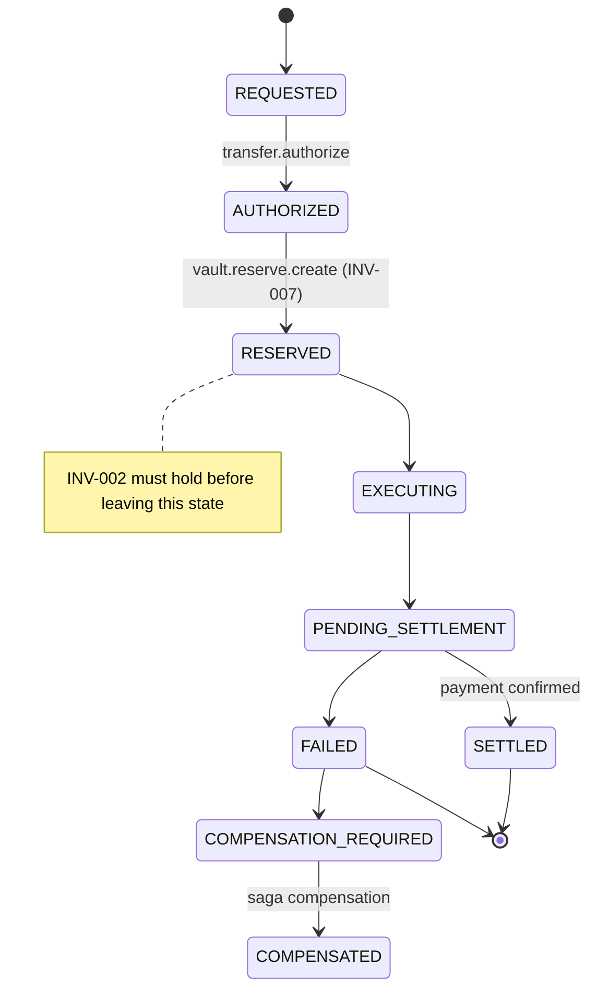

# State Machine Visualization Example

## Treasury Transfer Lifecycle (Simplified)

## Full 21 State Machines

See `05_state-machines.yaml` for complete definitions.

**Recommended Visuals to Generate:**
- Vault Asset Lifecycle (most complex)
- Payment Request Lifecycle
- Agent Execution Lifecycle (with escalation)

**Tooling Suggestion**: Use the existing TLA+ models + a visualizer, or generate PlantUML/Mermaid from the YAML state machines.