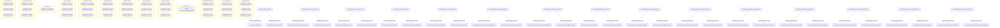

### SOVR Financial OS — Protocol Topology Flowchart

```mermaid
flowchart TD
  %% Root Domains
  subgraph AGENT [AGENT Domain]
    capability_agent_activate(["CAPABILITY: activate"])
    capability_agent_capability_bind(["CAPABILITY: bind"])
    capability_agent_capability_revoke(["CAPABILITY: revoke"])
  end
  subgraph ESCROW [ESCROW Domain]
    capability_escrow_account_cancel(["CAPABILITY: cancel"])
    capability_escrow_account_create(["CAPABILITY: create"])
    capability_escrow_account_fund(["CAPABILITY: fund"])
  end
  subgraph GOVERNANCE [GOVERNANCE Domain]
    capability_governance_amend_propose(["CAPABILITY: propose"])
    capability_governance_amend_ratify(["CAPABILITY: ratify"])
    capability_governance_audit_query(["CAPABILITY: query"])
  end
  subgraph HYBRID [HYBRID Domain]
    saga_cross_chain_settlement_saga(["SAGA: cross_chain_settlement_saga"])
  end
  subgraph IDENTITY [IDENTITY Domain]
    capability_identity_actor_archive(["CAPABILITY: archive"])
    capability_identity_actor_create(["CAPABILITY: create"])
    capability_identity_actor_read(["CAPABILITY: read"])
  end
  subgraph INTENT [INTENT Domain]
    capability_intent_archive(["CAPABILITY: archive"])
    capability_intent_cancel(["CAPABILITY: cancel"])
    capability_intent_convert(["CAPABILITY: convert"])
  end
  subgraph KERNEL [KERNEL Domain]
    event_saga_compensated(["EVENT: compensated"])
    event_saga_compensating(["EVENT: compensating"])
    event_saga_completed(["EVENT: completed"])
  end
  subgraph LEDGER [LEDGER Domain]
    capability_ledger_account_freeze(["CAPABILITY: freeze"])
    capability_ledger_account_manage(["CAPABILITY: manage"])
    capability_ledger_account_read(["CAPABILITY: read"])
  end
  subgraph PAYMENT [PAYMENT Domain]
    capability_payment_execution_compensate(["CAPABILITY: compensate"])
    capability_payment_execution_confirm(["CAPABILITY: confirm"])
    capability_payment_execution_execute(["CAPABILITY: execute"])
  end
  subgraph POLICY [POLICY Domain]
    capability_policy_compliance_create(["CAPABILITY: create"])
    capability_policy_escalation_resolve(["CAPABILITY: resolve"])
    capability_policy_rule_activate(["CAPABILITY: activate"])
  end
  subgraph SAGA [SAGA Domain]
    command_saga_compensate(["COMMAND: compensate"])
  end
  subgraph TREASURY [TREASURY Domain]
    capability_treasury_liquidity_manage(["CAPABILITY: manage"])
    capability_treasury_liquidity_read(["CAPABILITY: read"])
    capability_treasury_settlement_confirm(["CAPABILITY: confirm"])
  end
  subgraph VAULT [VAULT Domain]
    capability_vault_asset_create(["CAPABILITY: create"])
    capability_vault_asset_impair(["CAPABILITY: impair"])
    capability_vault_asset_read(["CAPABILITY: read"])
  end
  command_agent_suspend -->|command_produces_event| event_agent_terminated
  command_agent_suspend -->|command_produces_event| event_agent_termination_failed
  command_escrow_account_cancel -->|command_produces_event| event_escrow_account_cancellation_failed
  command_escrow_account_cancel -->|command_produces_event| event_escrow_account_cancelled
  command_escrow_account_create -->|command_produces_event| event_escrow_account_created
  command_escrow_account_create -->|command_produces_event| event_escrow_account_creation_failed
  command_escrow_account_fund -->|command_produces_event| event_escrow_account_funded
  command_escrow_account_fund -->|command_produces_event| event_escrow_account_funding_failed
  command_escrow_account_release -->|command_produces_event| event_escrow_account_release_failed
  command_escrow_account_release -->|command_produces_event| event_escrow_account_released
  command_governance_amend_propose -->|command_produces_event| event_governance_amendment_proposal_failed
  command_governance_amend_propose -->|command_produces_event| event_governance_amendment_proposed
  command_governance_amend_ratify -->|command_produces_event| event_governance_amendment_ratification_failed
  command_governance_amend_ratify -->|command_produces_event| event_governance_amendment_ratified
  command_governance_audit_query -->|command_produces_event| event_governance_audit_queried
  command_governance_audit_query -->|command_produces_event| event_governance_audit_query_failed
  command_governance_capability_grant -->|command_produces_event| event_governance_capability_grant_failed
  command_governance_capability_grant -->|command_produces_event| event_governance_capability_granted
  command_governance_capability_revoke -->|command_produces_event| event_governance_capability_revoke_failed
  command_governance_capability_revoke -->|command_produces_event| event_governance_capability_revoked
  command_governance_emergency_halt -->|command_produces_event| event_governance_emergency_halt_failed
  command_governance_emergency_halt -->|command_produces_event| event_governance_emergency_halt_issued
  command_governance_emergency_lift -->|command_produces_event| event_governance_emergency_halt_lift_failed
  command_governance_emergency_lift -->|command_produces_event| event_governance_emergency_halt_lifted
  command_governance_escalation_resolve -->|command_produces_event| event_governance_escalation_resolution_failed
  command_governance_escalation_resolve -->|command_produces_event| event_governance_escalation_resolved
  command_governance_oversight_review -->|command_produces_event| event_governance_oversight_review_failed
  command_governance_oversight_review -->|command_produces_event| event_governance_oversight_reviewed
  command_governance_policy_rule_review -->|command_produces_event| event_governance_policy_rule_review_failed
  command_governance_policy_rule_review -->|command_produces_event| event_governance_policy_rule_review_requested
```